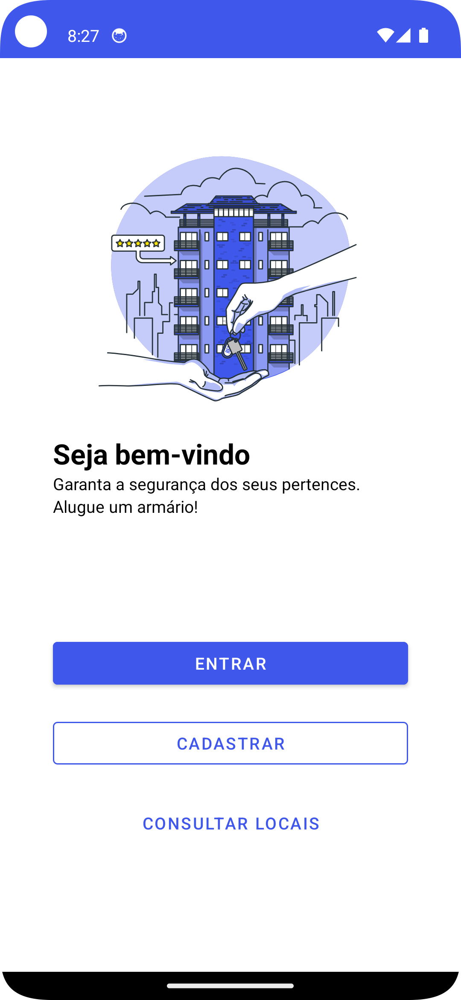
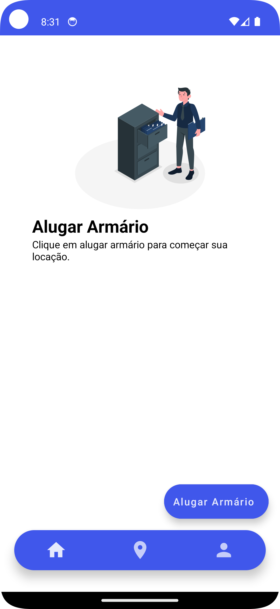
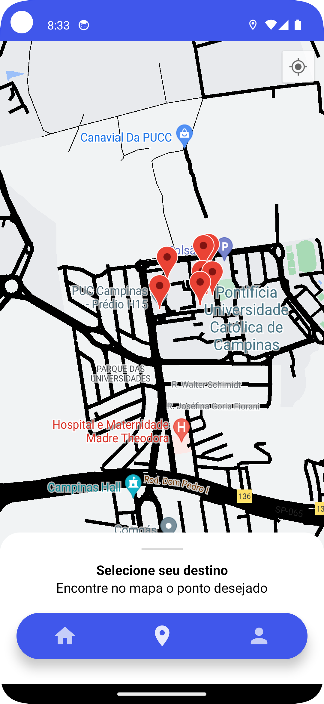
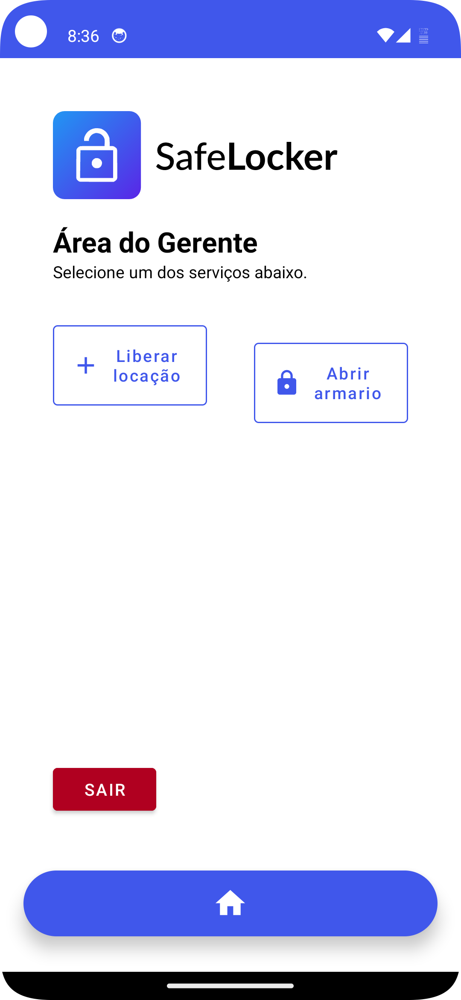

<h1 align="center">SafeLocker</h1>

# Sobre
SafeLocker é um aplicativo Android que visa guardar os pertences do cliente em um armário automatizado a fim de diminuir o incômodo de carregar seus pertences, com asssaltos ou arrastões. Então, quando estiverem em atividades turísticas, eventos ou praias, por exemplo, o usuário pode desligar a preocupação e alugar um armário que irá guardar seus objetos pessoais.

# Recursos
- Cadastro e Login
- Consultar Locais que contém os pontos de locação
- Habilitar cartão de crédito
- Listagem dos horários de determinado ponto de locação
- Identificação por NFC

# Tecnologias Utilizadas
- Linguagem Kotlin
- Firebase Firestore
- Firebase Authentication
- Firebase Functions
- Google Maps API
- Android Studio
- Figma

# Preview Parte do Usuário

  
  
  

# Preview Parte do Gerente

  

